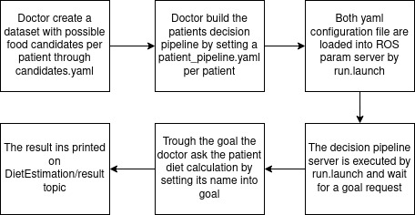

# Diet Estimation Example Implementation

<a rel="license" href="http://creativecommons.org/licenses/by-nc-nd/4.0/">

**Author:** João Pedro Carvalho de Souza

# <a name="index"></a> Index
* [Overview](#overview)
* [Example Overview](#overview_ex)


## <a name="overview"></a> 1. Overview

This package is an example package on how implement a ROS Action Skill implementation orientated to modularity and configurability. 
This examples takes into consideration ros, actionlib, C++ inheritance and polymorphisms, therefore the following prerequisites should be take place before the package study:

* [ROS](http://wiki.ros.org/ROS/Tutorials)
* [ROS Action](http://wiki.ros.org/actionlib/Tutorials)
* [C++ Inheritance](https://www.tutorialspoint.com/cplusplus/cpp_inheritance.htm)
* [C++ Polymorphism](https://www.tutorialspoint.com/cplusplus/cpp_polymorphism.htm)

## <a name="overview_ex"></a> 2. Example Overview

This examples relies on help nutritionist choose the best food to a patient according to a sequence of heuristics which can be defined into a 
pipeline structure.


<p align="center">
Diet estimation pipeline.
</p>

### 2.1. Setup package


### 2.1. Candidates dataset
The candidate.yaml is defined by patient and describes the feasible food candidate choices.
One file per patient is necessary and are provided by **/patient_name_candidates.yaml**.
The dataset file orders the candidates by suffix index, e.g., *candidate_n* is the n-th candidate. An example can be verified [here](../yaml/fulano_candidates.yaml):


### 2.2. Pipeline definition
Definition of the diet estimation pipeline cascade.
One file per object ordering the estimation heuristics by prefix index, e.g., *n_heuristic* is the *n-th* grasp heuristic.
The prefix must be ***one  alphanumeric digit***. At least one heuristic must be defined.
The example bellow set a pipeline with Protein Scorer -> Fiber Sorer  workflow of costs:

```
pipeline:
    0_protein_scorer:
        weight: 1
        threshold: 10 #in grams
    1_fiber_scorer:
        weight: 3
        threshold: 1 #in grams
```

### 2.3. Heuristics
#### 2.3.1. Protein scorer
Select the bast candidate by amount of protein in grams. If any value is under the threshold value, the candidate is automatically removed. Parameter list:
* threshold: threshold value in grams to eliminate candidate.
* weight: a scalar value of heuristic importance. Bigger value, more this heuristic affect the overall result. 

#### 2.3.2. Fiber scorer
Select the bast candidate by amount of fiber in grams. If any value is under the threshold value, the candidate is automatically removed. Parameter list:
* threshold: threshold value in grams to eliminate candidate.
* weight: a scalar value of heuristic importance. Bigger value, more this heuristic affect the overall result.

## 4. How to run
In the terminal execute the server by typing:

```
roslaunch diet_estimation_skill_server run.launch 
```

Call the goal to "Fulano" patient:
```
rostopic pub /DietEstimationSkill/goal diet_estimation_skill_msgs/DietEstimationSkillActionGoal "header:
  seq: 0
  stamp:
    secs: 0
    nsecs: 0
  frame_id: ''
goal_id:
  stamp:
    secs: 0
    nsecs: 0
  id: ''
goal:
  operation_mode: 0
  name: 'fulano'"
```

Check the result by:
```
rostopic echo /DietEstimationSkill/result 
```